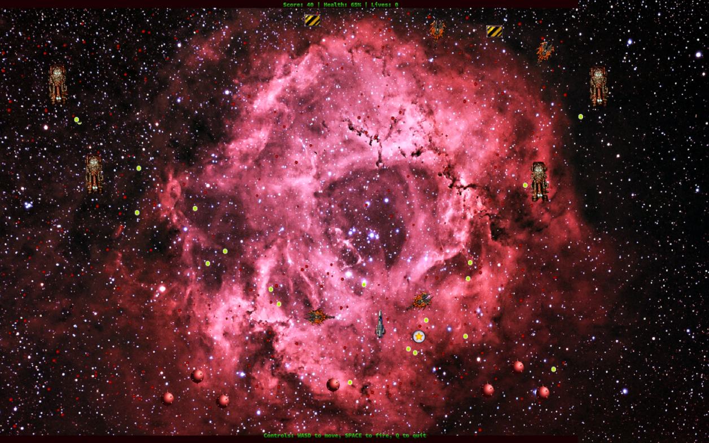

# SpaceFist

A 2d vertical scrolling space shooter game using LibGDX and Kotlin.


# Setup
 1. Using git, clone the repository and enter the SpaceFist directory.
 2. Install OpenJDK if it is not already installed.

# Running (Linux)
1. Open a terminal window.
2. Make sure that java can be run from the commandline (runing java -version should print something).
3. Navigate to the SpaceFist directory.
4. Type ```./gradlew desktop:run``` at the commandline and hit enter.

# Running (Windows)
1. Open a command window.
2. Make sure that java can be run from the commandline (runing java -version should print something)
3. Navigate to the SpaceFist directory
4. Type ```./gradlew.bat desktop:run``` and hit enter.
